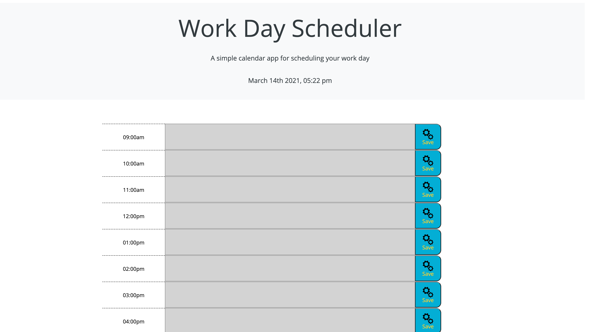

# Work Day Scheduler

## Description

A schedule application that can recieve text input within hour long time blocks.

## Features

* All input into time blocks can be saved with a click of a button.

* Once the save button is clicked the information is stored into localStorage and can be accessed
even on page refresh.

* The current time is displayed with the date at the top of the screen.
The text fields of the time blocks will change colors dynamically based on the current time,
red for current hour, green for future hours, and gray for past hours.

## Built With

* HTML
* CSS
* Bootstrap
* JavaScript
* JQuery
* Moment.js

## Website
(https://johnbanas.github.io/work-day-scheduler/)

## Example

## Contribution
Made with :heart: by John Patrick Banas 
Vanderbuilt Owen School of Engineering Bootcamp

All the different forums and the countless users on them that help me consistently: 
### GitHub
### StackOverflow
### CodePen
### Codecademy
### Coursera
### Udemy

